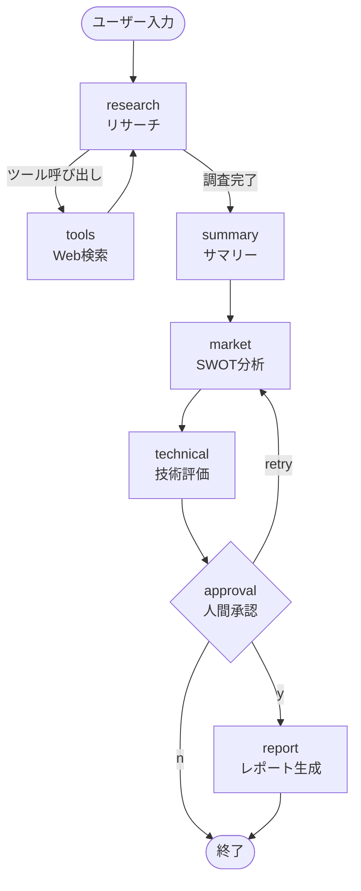

# Market Research Agent

テーマを入力すると、複数の AI エージェントが協調して **Web 調査 → 市場分析 → 投資家向けレポート生成** を自動実行するシステム。

処理の途中で人間が結果を確認・承認できる **HITL（Human-in-the-Loop）** 構造を持ち、承認後に最終レポートを生成する。

---

## デモ

```
テーマ入力: "宇宙ゴミの回収事業"

  [1] リサーチエージェント  → Tavily で Web 検索（最大3回）
  [2] サマリーエージェント  → 調査ログを基礎レポートに整理
  [3] 市場分析エージェント  → SWOT 分析
  [4] 技術評価エージェント  → CTO 視点で技術課題を指摘

  ↓ ここで処理が停止 ↓

  [人間] 承認（y）/ 修正依頼（retry）/ 却下（n）

  [5] レポートエージェント  → 投資家向け事業プランを生成
```

---

## アーキテクチャ



### 処理フローの設計意図

**ReAct ループ（research ↔ tools）**
LLM がツール呼び出しを必要と判断する間、Web 検索と再思考を繰り返す。
`MAX_TOOL_LOOPS` で無限ループを防止している。

**HITL（approval ノード）**
LangGraph の `interrupt()` を使い、承認ノードで処理を一時停止する。
状態は SQLite に保存されるため、サーバーを再起動してもユーザーの判断待ち状態を復元できる。

**analysis_messages の積み上げ設計**
summary → market → technical → report の各エージェントは `analysis_messages` に追記していく。
後続エージェントは全履歴を参照できるため、文脈を引き継いだ分析が可能になる。

---

## 技術スタック

| 種別 | 技術 |
|---|---|
| 言語 | Python 3.11 |
| AI オーケストレーション | LangGraph 1.0 |
| LLM | OpenAI GPT-4o-mini |
| Web 検索 | Tavily Search API |
| LLM フレームワーク | LangChain / LangChain-OpenAI |
| API サーバー | FastAPI + LangServe |
| 状態永続化 | SQLite（LangGraph Checkpointer） |

---

## ディレクトリ構成

```
backend/
├── config.py          # 設定・環境変数の管理
├── state.py           # グラフ全体で共有する State（TypedDict）
├── tools/
│   └── search.py      # Web 検索ツール（Tavily）
├── agents/
│   ├── research.py    # リサーチ + ツール実行ノード
│   ├── summary.py     # 調査ログ整理ノード
│   ├── market.py      # SWOT 分析ノード
│   ├── technical.py   # 技術評価ノード
│   └── report.py      # 人間承認 + レポート生成ノード
├── graph.py           # グラフ組み立て・API ヘルパー
└── server.py          # FastAPI エントリーポイント
```

各エージェントはプロンプト・モデル・ノード関数を 1 ファイルに収め、自己完結した設計にしている。

---

## セットアップ

### 必要なもの

- Python 3.11 以上
- OpenAI API キー
- Tavily API キー（[無料プラン](https://tavily.com/) あり）

### 手順

```bash
# 1. 仮想環境の作成と有効化
python -m venv .venv
source .venv/bin/activate   # Windows: .venv\Scripts\activate

# 2. 依存関係のインストール
pip install -r requirements.txt

# 3. 環境変数の設定
cp .env.example .env
# .env を開いて OPENAI_API_KEY と TAVILY_API_KEY を入力

# 4. サーバー起動
uvicorn backend.server:app --reload
```

### API の使い方

**新規実行**
```bash
curl -X POST http://localhost:8000/agent/invoke \
  -H "Content-Type: application/json" \
  -d '{"input": {"action": "start", "theme": "宇宙ゴミの回収事業"}}'
```

**承認（人間が判断を返す）**
```bash
curl -X POST http://localhost:8000/agent/invoke \
  -H "Content-Type: application/json" \
  -d '{"input": {"action": "resume", "thread_id": "<返ってきたID>", "decision": "y"}}'
```

`decision` には `y`（承認）/ `n`（却下）/ `retry`（市場分析からやり直し）を指定する。

---

## 環境変数

| 変数名 | 必須 | 説明 | デフォルト |
|---|---|---|---|
| `OPENAI_API_KEY` | ✅ | OpenAI API キー | - |
| `TAVILY_API_KEY` | ✅ | Tavily 検索 API キー | - |
| `MODEL_NAME` | | 使用する LLM モデル | `gpt-4o-mini` |
| `MAX_TOOL_LOOPS` | | リサーチの最大ループ数 | `3` |
| `CHECKPOINT_DB_PATH` | | SQLite DB のパス | `checkpoints.sqlite` |
| `DEBUG_MODE` | | デバッグログの出力 | `false` |
